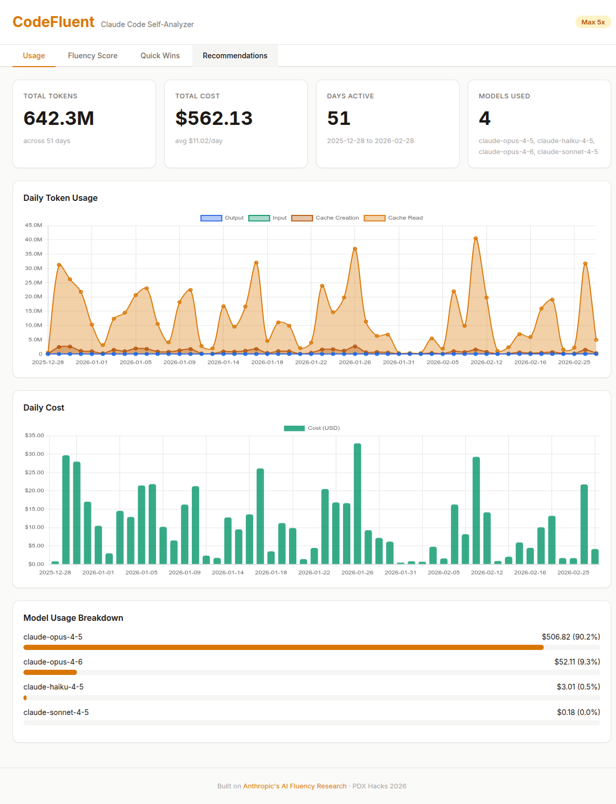
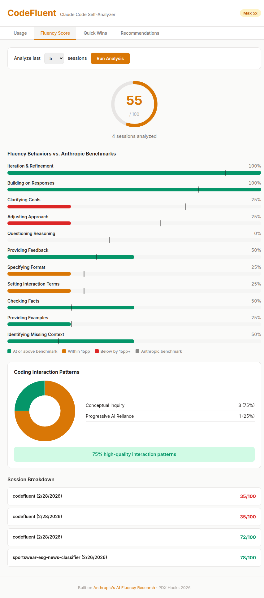
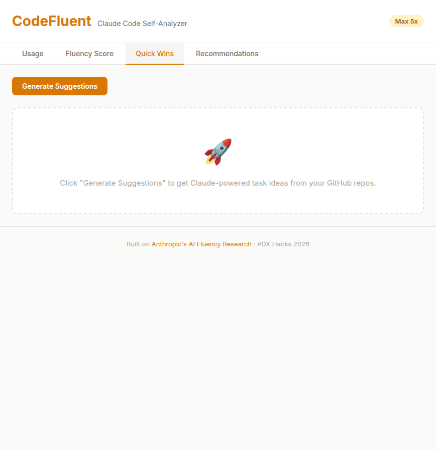
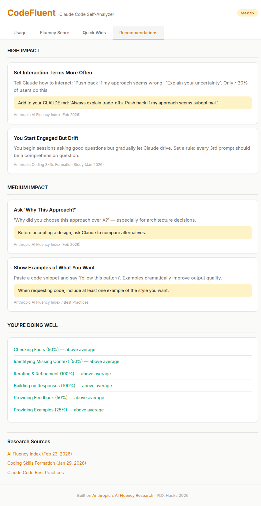

# CodeFluent

**Personal AI fluency analytics for Claude Code users.**

CodeFluent reads your local Claude Code session data, scores your prompting behaviors against [Anthropic's AI Fluency Research](https://www.anthropic.com/research/AI-fluency-index), and gives you actionable recommendations to become a more effective AI collaborator.

Built at **PDX Hacks 2026**.

## Screenshots

| Usage | Fluency Score |
|-------|---------------|
|  |  |

| Quick Wins | Recommendations |
|------------|-----------------|
|  |  |

## Features

- **Usage Dashboard** — Token consumption, cost tracking, and model breakdown from your Claude Code history via [ccusage](https://github.com/yohasebe/ccusage). Stacked area chart shows cache read/creation/input/output token breakdown.
- **Fluency Score** — Scores your sessions against Anthropic's 11 fluency behaviors and 6 coding interaction patterns using the Anthropic API as a scoring engine. Compares your results to published benchmarks.
- **Quick Wins** — Scans your GitHub repos and open issues, then generates copy-paste-ready Claude Code prompts for high-value tasks you could tackle right now.
- **Recommendations** — Personalized, research-backed suggestions prioritized by impact, with links to the underlying Anthropic research papers.

## How It Works

1. `ccusage` reads your Claude Code session history and exports token/cost data as JSON
2. `extract_prompts.py` parses JSONL session files from `~/.claude/projects/` to extract user prompts and metadata (plan mode usage, tool diversity, thinking count)
3. The FastAPI backend sends prompts to `claude-sonnet-4-20250514` for fluency scoring against the 4D AI Fluency Framework
4. The vanilla JS frontend renders everything with Chart.js — no build step, no framework

Everything runs locally. No data leaves your machine except the API calls to Anthropic for scoring.

## Tech Stack

- **Backend:** Python 3.12 / FastAPI / uvicorn
- **Frontend:** Vanilla HTML/CSS/JS + Chart.js (CDN)
- **Scoring:** Anthropic API (`claude-sonnet-4-20250514`)
- **Usage data:** [ccusage](https://github.com/yohasebe/ccusage) (reads Claude Code sessions)
- **Package manager:** [uv](https://github.com/astral-sh/uv)

## Setup

### Prerequisites

- Python 3.12+
- Node.js (for `npx ccusage`)
- An [Anthropic API key](https://console.anthropic.com/)
- `gh` CLI (optional, for Quick Wins feature)

### Install

```bash
git clone https://github.com/frederick-douglas-pearce/codefluent.git
cd codefluent
uv sync
```

### Configure

Create a `.env` file with your API key:

```
ANTHROPIC_API_KEY=sk-ant-...
```

### Generate Data

```bash
# Export usage data from Claude Code history
mkdir -p data/ccusage data/prompts
npx ccusage@latest daily --json > data/ccusage/daily.json
npx ccusage@latest monthly --json > data/ccusage/monthly.json
npx ccusage@latest session --json -o desc > data/ccusage/session.json

# Extract prompts for fluency scoring
uv run python extract_prompts.py
```

### Run

```bash
uv run uvicorn main:app --reload --host 0.0.0.0 --port 8000
```

Open http://localhost:8000

## Project Structure

```
codefluent/
├── main.py                # FastAPI backend (API endpoints + scoring)
├── extract_prompts.py     # JSONL prompt extractor
├── static/
│   ├── index.html         # Single-page app
│   ├── app.js             # Frontend logic + Chart.js rendering
│   └── style.css          # Anthropic-inspired design system
├── data/                  # Generated data (gitignored)
│   ├── ccusage/           # ccusage JSON exports
│   ├── prompts/           # Extracted session prompts
│   └── scores.json        # Cached fluency scores
├── docs/                  # Design docs and specs
├── pyproject.toml
└── CLAUDE.md              # AI coding instructions
```

## Research Foundations

- [Anthropic AI Fluency Index](https://www.anthropic.com/research/AI-fluency-index) (Feb 2026) — 11 behavioral indicators and population benchmarks
- [Coding Skills Formation with AI](https://www.anthropic.com/research/coding-skill-formation) (Jan 2026) — 6 coding interaction patterns and quality analysis
- [Claude Code Best Practices](https://www.anthropic.com/research/claude-code-best-practices) — Practical guidelines for effective AI collaboration

## License

MIT
