# CodeFluent

**Personal AI fluency analytics for Claude Code users.**

Millions of developers use AI coding assistants daily, but nobody knows if they're using them *well*. Anthropic's research shows most users exhibit only 3 of 11 key fluency behaviors, and that interaction patterns directly predict whether developers build skills or lose them.

CodeFluent reads your local Claude Code session data, scores your prompting behaviors against [Anthropic's AI Fluency Research](https://www.anthropic.com/research/AI-fluency-index), and gives you actionable recommendations to become a more effective AI collaborator. Available as a **VS Code extension** and a **standalone web app**.

Originally built at PDX Hacks 2026. Now publicly available and actively maintained.

### How It Compares

Several tools exist for monitoring Claude Code usage — but they all measure *what happened*, not *how well you collaborated*:

| Tool | What it measures | What's missing |
|------|-----------------|----------------|
| [ccusage](https://github.com/ryoppippi/ccusage) | Token counts, costs, model breakdown | No behavioral analysis |
| [Sniffly](https://github.com/chiphuyen/sniffly) (Chip Huyen) | Usage stats, error analysis, message history | Analyzes *Claude's* errors, not user behavior |
| [Claude-Code-Usage-Monitor](https://github.com/Maciek-roboblog/Claude-Code-Usage-Monitor) | Real-time token consumption, rate limit predictions | No quality scoring |
| [Anthropic Official Analytics](https://code.claude.com/docs/en/analytics) | PRs merged, lines committed, team adoption | Org-level metrics, no individual fluency |
| [DX Platform](https://getdx.com/) | Developer velocity, AI adoption rates | Enterprise focus, not behavioral |
| **CodeFluent** | **Fluency behaviors, interaction patterns, personalized coaching** | **The gap everyone else leaves open** |

Anthropic's own AI Fluency Index noted they "plan deeper study into Claude Code" but haven't shipped any behavioral scoring tool. CodeFluent fills that gap today.

### Why This Is Different

- **Research-grounded, not vibes.** Every score maps to Anthropic's AI Fluency Index (Feb 2026) and Coding Skills Formation study (Jan 2026). The benchmark bars are real population data.
- **First to score collaboration quality.** Existing tools count tokens or track errors. CodeFluent is the first to analyze *how* you interact with AI and whether your patterns build or erode skills.
- **AI evaluating AI collaboration.** Claude scores your prompts against the fluency framework, creating a feedback loop: the AI tells you how to work with it more effectively.
- **Not just scoring — active coaching.** The Prompt Optimizer and Quick Wins generate ready-to-use prompts that incorporate missing fluency behaviors and respect your project's CLAUDE.md config. They don't just tell you what to improve — they show you how.
- **Connects fluency to cost.** Session analytics links your fluency scores to token spending and cache efficiency, revealing which collaboration patterns are most cost-effective. No other tool examines these relationships.
- **Native VS Code integration.** Lives in your sidebar, respects your theme, launches Claude Code sessions directly from suggestions.
- **Completely local and private.** All session data stays on your machine. The only external calls are to the Anthropic API for scoring.
- **No server infrastructure.** No database, no auth, no backend to maintain. Install the `.vsix` and go.

## Supported Platforms

| Platform | VS Code Extension | Web App | Shell used |
|----------|:-:|:-:|------------|
| Linux | Yes | Yes | `/bin/bash` |
| macOS | Yes | Yes | `/bin/bash` |
| Windows | Yes | Yes | `cmd.exe` |

Terminal launch, shell escaping, subprocess invocation, and session path resolution all adapt automatically to the host platform. No configuration required.

## Getting Started

### Prerequisites

- **All platforms:** Node.js 22+ (for `npx ccusage`), an [Anthropic API key](https://console.anthropic.com/settings/keys) (sign up at [console.anthropic.com](https://console.anthropic.com/) if you don't have one), [`gh` CLI](https://cli.github.com/) authenticated (`gh auth login` must be run before Quick Wins works), Git
- **VS Code extension:** VS Code 1.85+
- **Web app:** Python 3.12+ / `uv`
- **Windows:** No additional dependencies. The extension automatically uses `cmd.exe` and `npx.cmd` where needed.

### VS Code Extension

**Linux / macOS:**

```bash
git clone https://github.com/frederick-douglas-pearce/codefluent.git
cd codefluent/vscode-extension
npm install
npm run compile
npx @vscode/vsce package --allow-missing-repository
code --install-extension codefluent-0.2.2.vsix
```

**Windows (PowerShell):**

```powershell
git clone https://github.com/frederick-douglas-pearce/codefluent.git
cd codefluent\vscode-extension
npm install
npm run compile
npx @vscode/vsce package --allow-missing-repository
code --install-extension codefluent-0.2.2.vsix
```

Then reload VS Code. The CodeFluent icon appears in the activity bar.

### Web App

**Linux / macOS:**

```bash
git clone https://github.com/frederick-douglas-pearce/codefluent.git
cd codefluent/webapp
uv sync
uv run uvicorn main:app --reload --host 0.0.0.0 --port 8000
```

**Windows (PowerShell):**

```powershell
git clone https://github.com/frederick-douglas-pearce/codefluent.git
cd codefluent\webapp
uv sync
uv run uvicorn main:app --reload --host 0.0.0.0 --port 8000
```

Then open `http://localhost:8000` in your browser. Usage data is fetched on demand via the **Refresh** button in the Usage tab — no manual `ccusage` commands needed. See [`webapp/README.md`](webapp/README.md) for detailed setup instructions.

### Configure (API Key)

The extension looks for your API key in this order:

1. `ANTHROPIC_API_KEY` environment variable
2. `.env` file in the workspace root
3. VS Code secret storage (persisted after first prompt)
4. Interactive prompt (stored in VS Code secrets for next time)

The web app reads `ANTHROPIC_API_KEY` from the environment or a `.env` file in the `webapp/` directory.

**`.env` file format:**

```
ANTHROPIC_API_KEY=sk-ant-api03-...
```

### Session Data Location

Claude Code stores session files at `~/.claude/projects/` on all platforms:

| Platform | Path |
|----------|------|
| Linux | `~/.claude/projects/` |
| macOS | `~/.claude/projects/` |
| Windows | `C:\Users\<username>\.claude\projects\` |

The extension resolves this automatically via the system home directory.

> **Note:** Session transcript files are only available from late January 2026 onward. Earlier Claude Code usage was not persisted as full transcripts. Subagent sessions (AI-spawned) are excluded from scoring. See [`docs/SESSION_DATA.md`](docs/SESSION_DATA.md) for details on data availability, storage format, and scoring scope.

## Screenshots

### Web App

| Fluency Score | Recommendations |
|---------------|-----------------|
| 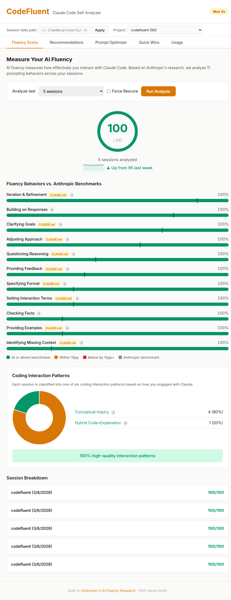 | 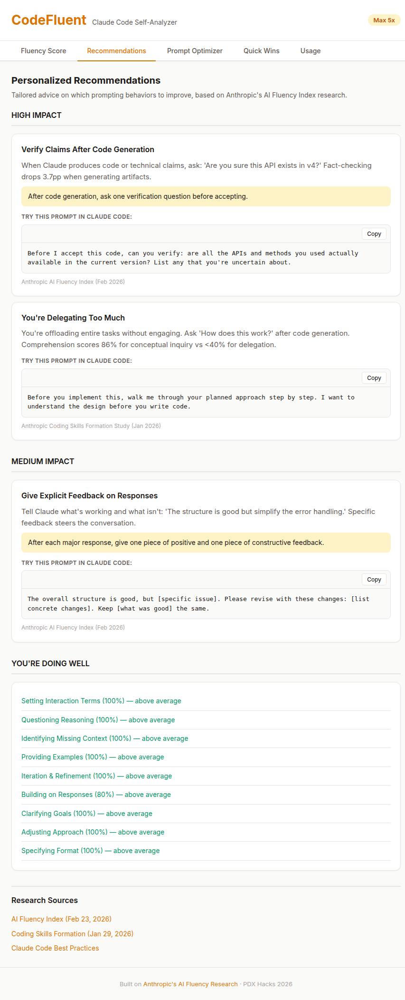 |

| Prompt Optimizer | Quick Wins |
|------------------|------------|
| 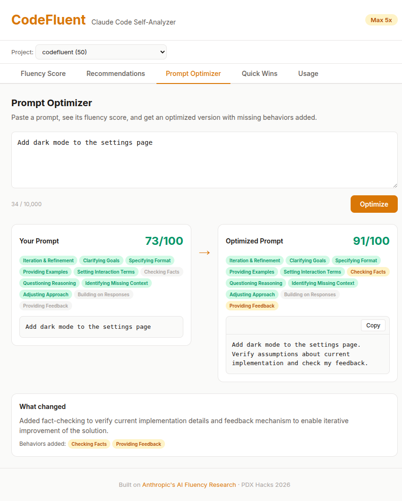 | 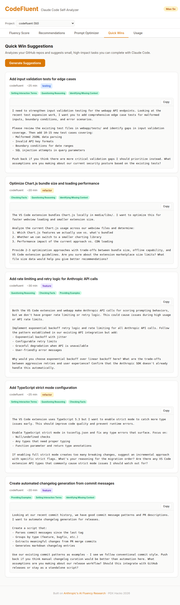 |

| Usage | Session Analytics |
|-------|-------------------|
| 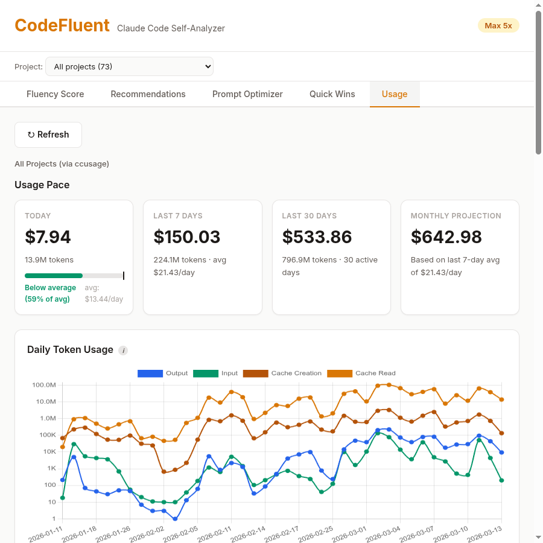 | 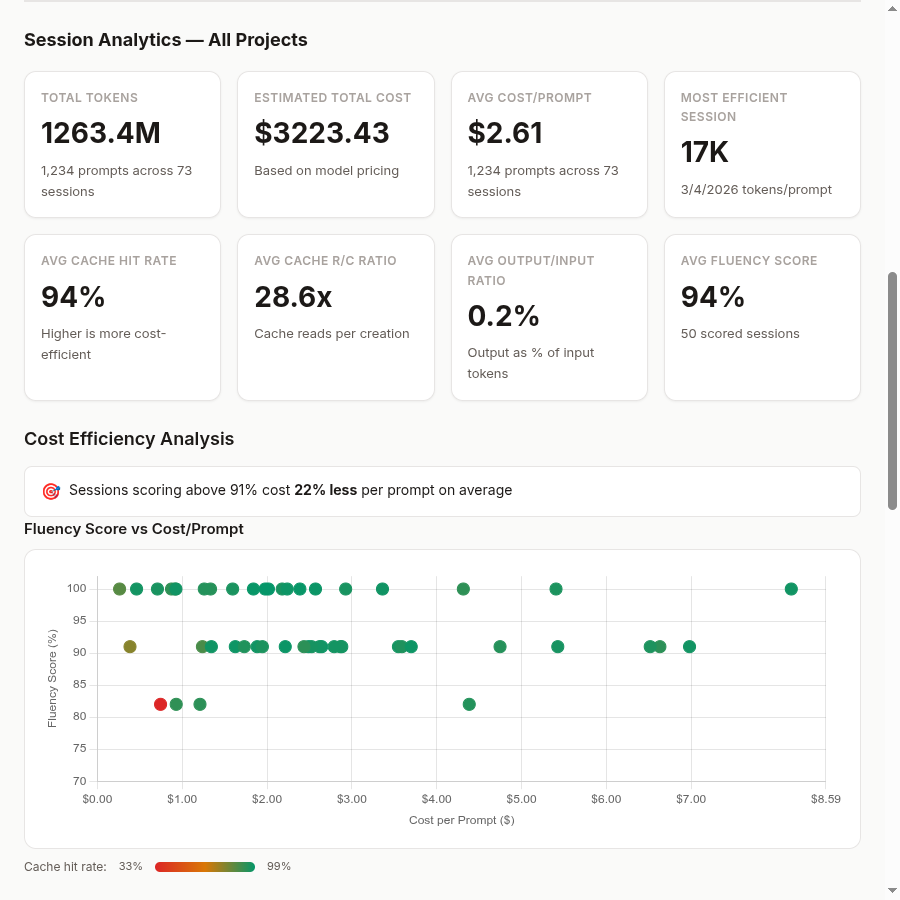 |

| Cost Efficiency Charts |
|------------------------|
| 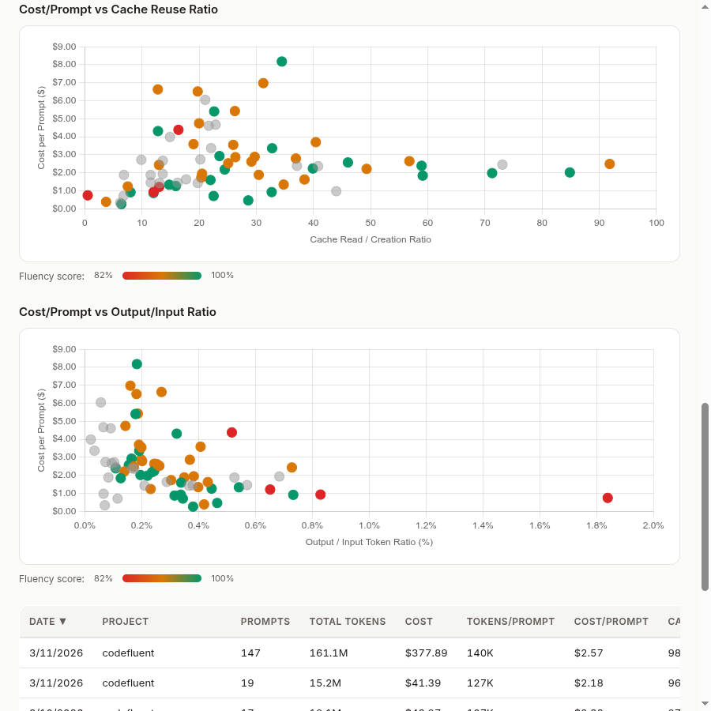 |

### VS Code Extension

| Fluency Score | Recommendations |
|---------------|-----------------|
| 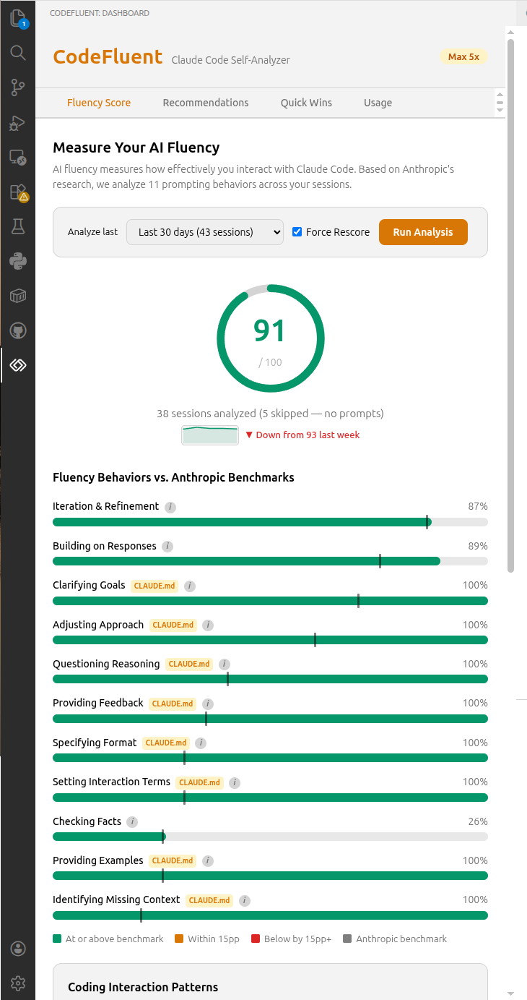 | 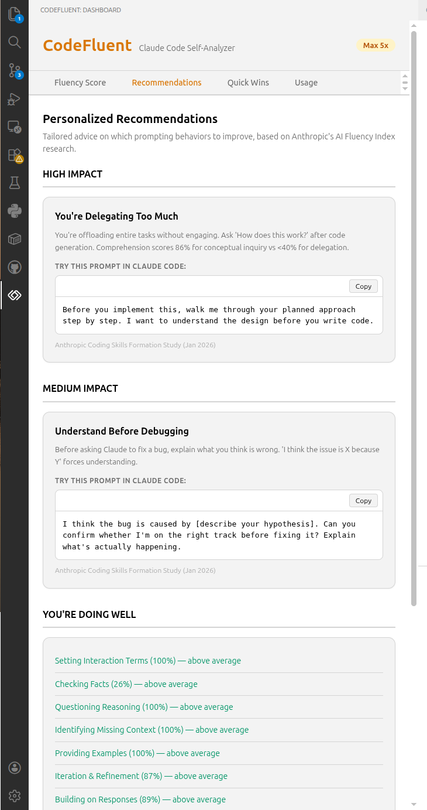 |

| Prompt Optimizer | Quick Wins |
|------------------|------------|
| 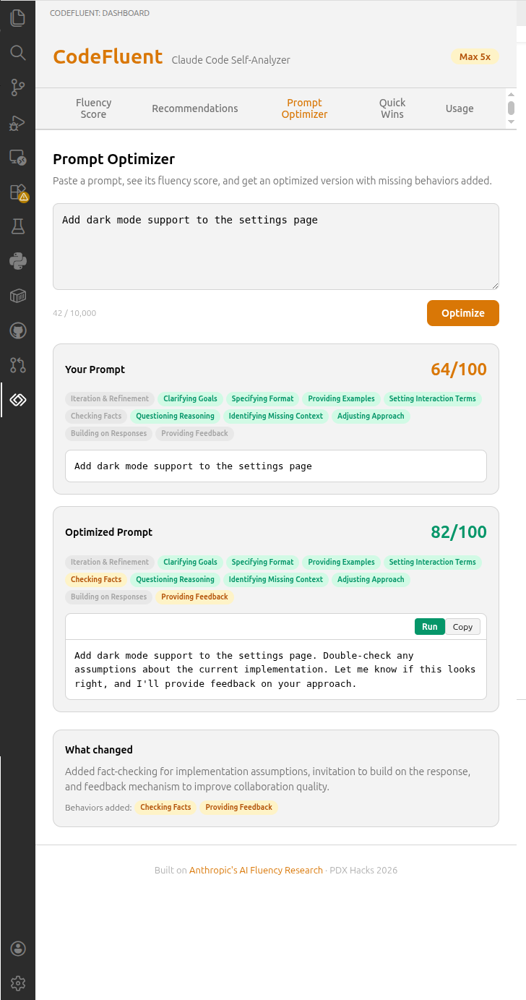 | 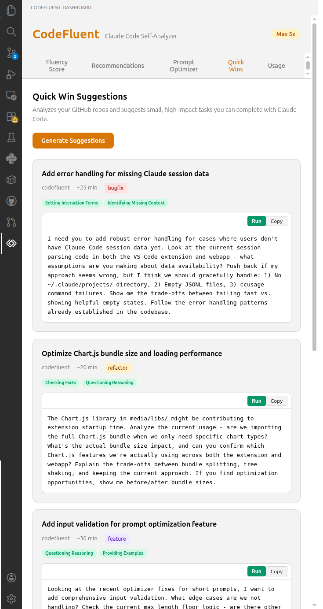 |

| Usage | Session Analytics |
|-------|-------------------|
| 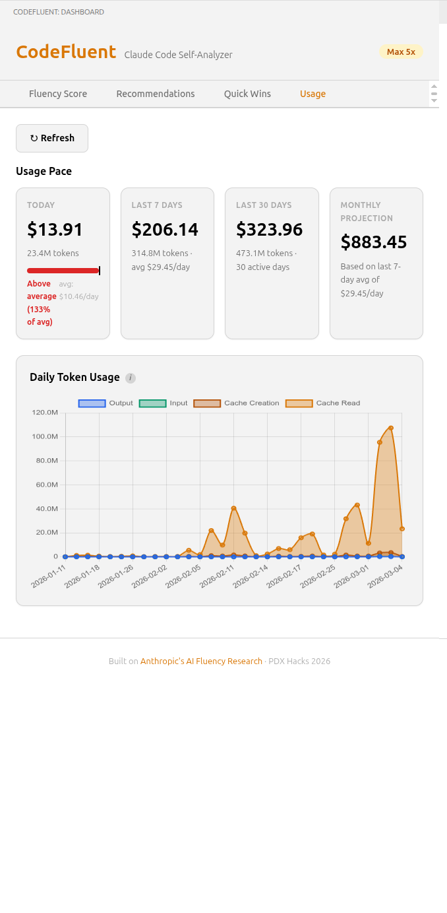 | 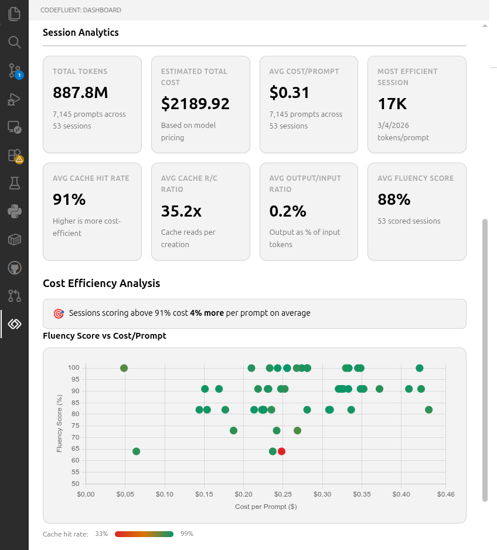 |

| Cost Efficiency Charts |
|------------------------|
| 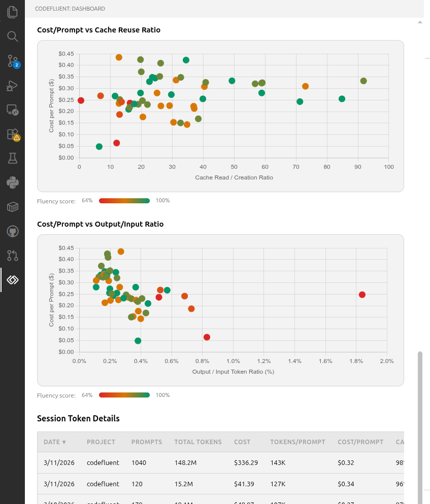 |

## Features

- **Fluency Score** — Scores your sessions against Anthropic's 11 fluency behaviors and 6 coding interaction patterns. Compares your results to published population benchmarks with color-coded bar charts.
- **Recommendations** — Personalized, research-backed coaching prioritized by impact, with copy-ready prompts and links to the underlying Anthropic research papers.
- **Prompt Optimizer** — Paste any prompt and get an optimized version that naturally incorporates missing fluency behaviors. Considers your CLAUDE.md config so it won't add behaviors already covered by project conventions. Shows before/after effective scores, highlights added behaviors, and lets you copy or run the improved prompt directly.
- **Quick Wins** — Scans your GitHub repos (commits, issues, README status) and generates copy-paste-ready Claude Code prompts for high-value tasks. In the VS Code extension, a "Run" button launches Claude Code in an integrated terminal with the suggested prompt. In the web app, prompts are copied to clipboard for pasting into your terminal — giving you more control and safer cross-platform behavior.
- **Usage Dashboard** — Two complementary views of your Claude Code usage. **All-projects analytics** (via [ccusage](https://github.com/ryoppippi/ccusage)) shows daily usage pace cards, cost projections, and a stacked token breakdown chart across all projects. **Session analytics** (from parsed JSONL history) shows per-session efficiency metrics — cost/prompt, cache hit rates, output/input ratios — with summary cards, three cost-efficiency scatter charts colored by fluency score, and a sortable details table. A **Refresh** button fetches the latest data on demand.
- **CLAUDE.md Config Scoring** — Scores your project's CLAUDE.md file against the same 11 fluency behaviors. Behaviors defined as project conventions (e.g., "push back if wrong") boost your effective score via `session OR config` logic, with a "CLAUDE.md" attribution tag in the UI.
- **Status Bar** — Shows your aggregate fluency score at a glance in the VS Code status bar.
- **VS Code Theming** — Automatically respects your light/dark theme.
- **Project Scoping (Web App)** — A project dropdown filters fluency scoring, prompt optimization, quick wins, and session analytics to a specific project, so you can analyze each codebase independently.

## How It Works

1. The extension parses JSONL session files from `~/.claude/projects/` to extract user prompts and metadata (plan mode usage, tool diversity, thinking count)
2. `ccusage` reads your Claude Code session history and exports token/cost data
3. User prompts are sent to `claude-sonnet-4-20250514` for fluency scoring against Anthropic's 4D AI Fluency Framework
4. If a `CLAUDE.md` exists in the workspace, it's scored separately against the same 11 behaviors — effective behavior = session OR config
5. The Prompt Optimizer analyzes any prompt against the 11 behaviors, factors in CLAUDE.md config (scoring on demand if not cached), then generates an optimized version that incorporates only the missing behaviors not already covered by project conventions
6. Results are cached locally in VS Code's extension storage (by session ID and CLAUDE.md content hash) to avoid re-scoring
7. Quick Wins uses the `gh` CLI to pull repo context and open issues, scoped to the current workspace

Everything runs locally. No data leaves your machine except the API calls to Anthropic for scoring.

## Security

| Layer | Mechanism | Protects Against |
|-------|-----------|------------------|
| XSS | `escapeHtml()` on all user-controlled output | Script injection |
| CSP | Nonce-based `script-src` in webview | Inline script execution |
| Shell injection | `execFileSync` with arg arrays + GitHub name validation | Command injection |
| API key secrets | VS Code SecretStorage / env var / `.env` | Credential leakage |
| Input validation | Pydantic constraints, length limits, path checks | Oversized payloads, path traversal |
| Rate limiting | 10 req/min sliding window (webapp) | API abuse |
| CORS | Localhost-only default (webapp) | Unauthorized cross-origin access |
| Automated testing | 769 tests including security-focused suites | Regressions |
| CI security review | Claude security review on PRs | New vulnerabilities |

All user-controlled strings are escaped before rendering in HTML. Shell commands use argument arrays (`execFileSync`) instead of string interpolation. The webapp validates all inputs with Pydantic models and enforces rate limits. Security-focused test suites verify XSS and injection protections.

## Troubleshooting

| Problem | Solution |
|---------|----------|
| **No sessions found** | Check that `~/.claude/projects/` contains `.jsonl` session files. Claude Code creates these automatically during use. |
| **API key not found** | The extension checks: env var → workspace `.env` → VS Code secrets → interactive prompt. Make sure `ANTHROPIC_API_KEY` is set in at least one location. |
| **Quick Wins shows no results** | Run `gh auth login` to authenticate the GitHub CLI. Quick Wins requires `gh` to fetch repo context and issues. |
| **ccusage returns no data** | Click the Refresh button in the Usage tab, or run `npx ccusage@latest daily --json` manually to verify output. Ensure you've used Claude Code at least once so session data exists. |
| **Extension doesn't activate** | Look for the CodeFluent icon in the VS Code activity bar (left sidebar). If missing, try reloading the window (`Ctrl+Shift+P` → "Reload Window"). |
| **VSIX is too small (~100KB)** | The `.vscodeignore` file must not exclude `node_modules/`. The Anthropic SDK is a runtime dependency and must be bundled. Expected VSIX size is ~1.2MB. |

## Tech Stack

- **VS Code extension:** TypeScript / VS Code WebviewViewProvider
- **Web app:** Python / FastAPI / `uv`
- **Frontend (both):** Vanilla HTML/CSS/JS + Chart.js (bundled locally)
- **Scoring:** Anthropic API (`claude-sonnet-4-20250514`)
- **Usage data:** [ccusage](https://github.com/ryoppippi/ccusage) (reads Claude Code sessions)
- **GitHub integration:** `gh` CLI
- **Testing:** Jest + ts-jest (extension)

## Project Structure

```
codefluent/
├── vscode-extension/          # VS Code extension (primary)
│   ├── src/
│   │   ├── extension.ts       # Activation, status bar, command registration
│   │   ├── webviewProvider.ts # WebviewViewProvider, IPC, terminal launch
│   │   ├── parser.ts          # JSONL session file parsing
│   │   ├── scoring.ts         # Fluency scoring via Anthropic API
│   │   ├── usage.ts           # ccusage CLI bridge
│   │   ├── quickwins.ts       # GitHub integration + task suggestions
│   │   ├── prompts.ts         # Prompt loader + template filler
│   │   ├── analytics.ts       # Session token analytics (efficiency, cost)
│   │   ├── pricing.ts         # Token pricing lookup
│   │   ├── cache.ts           # Persistent score caching
│   │   ├── dataCache.ts       # Session/usage data caching
│   │   └── platform.ts        # Cross-platform shell, terminal, subprocess helpers
│   ├── media/
│   │   ├── index.html         # Webview UI
│   │   ├── app.js             # Frontend logic + Chart.js rendering
│   │   ├── style.css          # VS Code theme-aware design system
│   │   ├── icon.svg           # Activity bar icon
│   │   └── libs/chart.min.js  # Chart.js (bundled, no CDN)
│   ├── test/
│   │   ├── unit/              # Unit tests (scoring, parsing, caching, XSS, platform)
│   │   └── integration/       # Integration tests (extension, webview)
│   ├── package.json
│   └── tsconfig.json
├── webapp/                    # FastAPI web app (standalone alternative)
│   ├── main.py                # FastAPI backend
│   ├── extract_prompts.py     # Python JSONL prompt extractor
│   ├── static/                # Web frontend (HTML/CSS/JS)
│   ├── tests/                 # Pytest suite (API, security, helpers, prompts)
│   └── pyproject.toml         # Python dependencies
├── shared/                    # Shared resources (both interfaces)
│   ├── benchmarks.json        # Population benchmark data
│   ├── pricing.json           # Token pricing by model
│   └── prompts/               # Versioned prompt templates
│       ├── registry.json      # Active version pointers
│       ├── scoring/v1.0.md        # Session scoring prompt
│       ├── config/v1.0.md         # CLAUDE.md scoring prompt
│       ├── optimizer/v1.1.md      # Prompt optimizer prompt (config-aware)
│       └── single_scoring/v1.0.md # Single-prompt verification scorer
├── docs/                      # Design docs and specs
│   ├── PROJECT_PLAN.md
│   ├── TECHNICAL_SPEC.md
│   ├── UI_SPEC.md
│   ├── SESSION_DATA.md
│   ├── REFERENCES.md
│   └── DEMO_SCRIPT.md
├── images/                    # Demo screenshots
└── CLAUDE.md                  # AI coding instructions
```

## Development

### VS Code Extension

```bash
cd vscode-extension
npm install
npm run watch          # Continuous TypeScript compilation
# Press F5 in VS Code to launch Extension Development Host
```

See [`vscode-extension/README.md`](vscode-extension/README.md) for full setup, packaging, and installation details.

### Web App

```bash
cd webapp
uv sync
uv run uvicorn main:app --reload --host 0.0.0.0 --port 8000
```

See [`webapp/README.md`](webapp/README.md) for configuration, CORS, and Windows notes.

### Testing

The project has **769 automated tests** across both interfaces:

```bash
cd vscode-extension
npm test                   # 528 tests across 14 suites (Jest)

cd webapp
uv run pytest tests/ -v    # 241 tests across 5 suites (pytest)
```

Test suites cover scoring, parsing, caching, analytics, pricing, XSS prevention, shell injection, path traversal, rate limiting, CORS, and API surface. All tests must pass before merging to main.

### CI/CD

Four GitHub Actions workflows run automatically:

- **CI** (`ci.yml`) — Runs on every PR: compiles TypeScript, runs all 769 tests, plus `npm audit` and `pip-audit` for dependency vulnerabilities. Must pass to merge.
- **Claude Code Review** (`claude-review.yml`) — AI-powered PR review, responds to `@claude` mentions.
- **Security Review** (`security-review.yml`) — Grep-based checks for security anti-patterns (inline onclick, string interpolation in shell commands, missing escapeHtml).
- **Release** (`release.yml`) — Triggered by version tags (`v*`). Builds VSIX and creates GitHub Release.

### Branching Strategy

- **`main`** — Always releasable. Protected by CI, requires a PR to merge.
- **`feature/<issue>-desc`** — New features (e.g., `feature/44-remaining-recommendations`)
- **`fix/<issue>-desc`** — Bug fixes (e.g., `fix/46-cache-unbounded`)

## Contributing

Contributions are welcome! See [`CONTRIBUTING.md`](CONTRIBUTING.md) for dev setup, code conventions, security rules, and the PR checklist.

## Research Foundations

- [Anthropic AI Fluency Index](https://www.anthropic.com/research/AI-fluency-index) (Feb 2026) — 11 behavioral indicators and population benchmarks
- [Coding Skills Formation with AI](https://www.anthropic.com/research/coding-skill-formation) (Jan 2026) — 6 coding interaction patterns and quality analysis
- [Claude Code Best Practices](https://www.anthropic.com/research/claude-code-best-practices) — Practical guidelines for effective AI collaboration

## License

[MIT](LICENSE)
