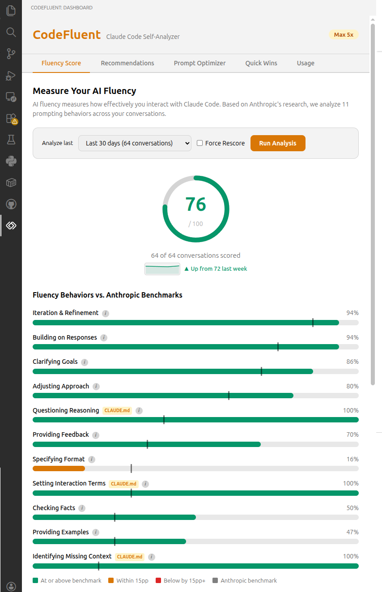
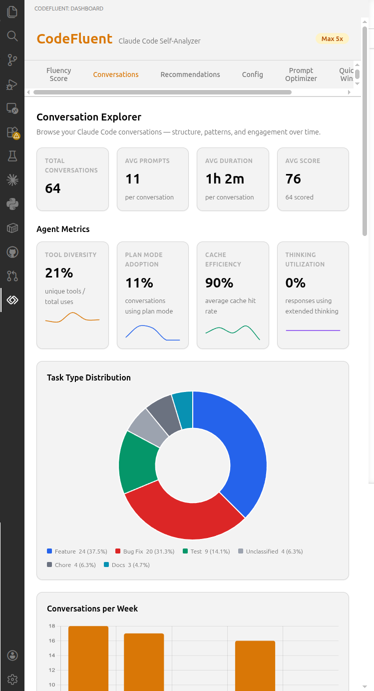
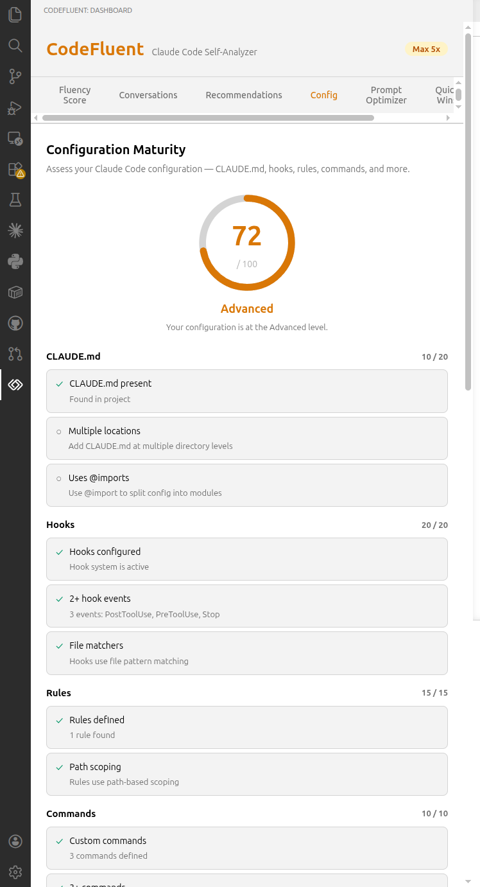
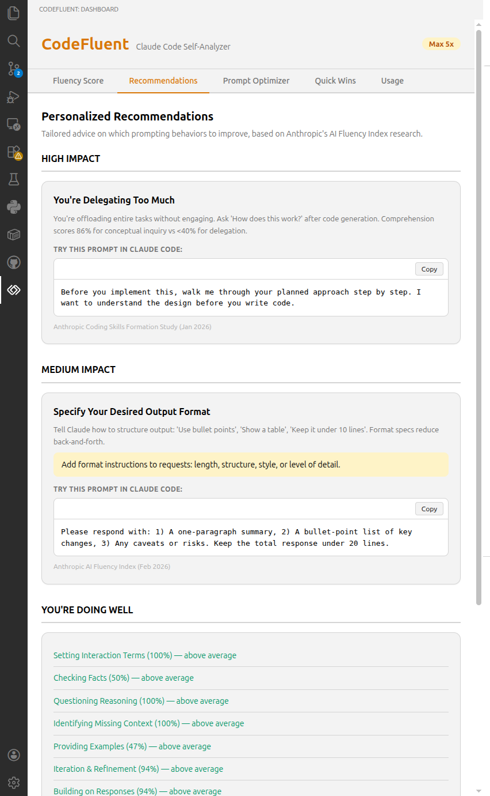
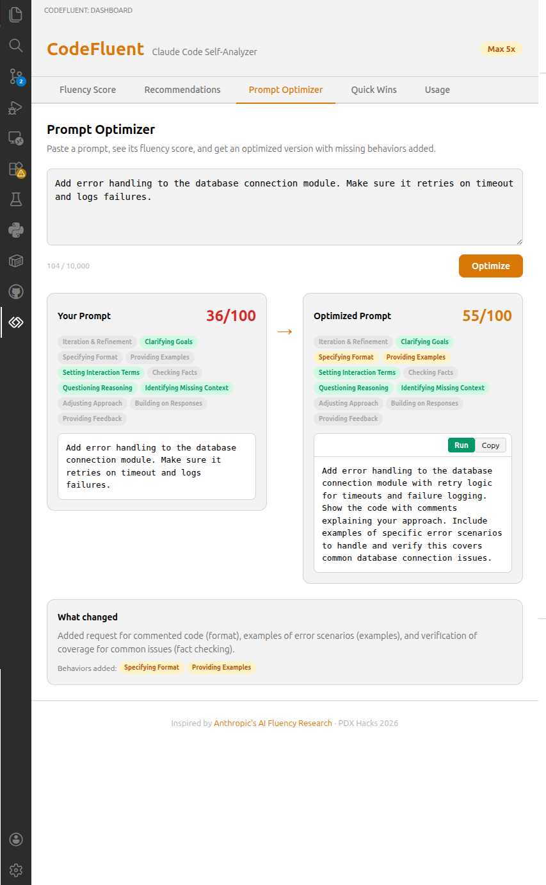
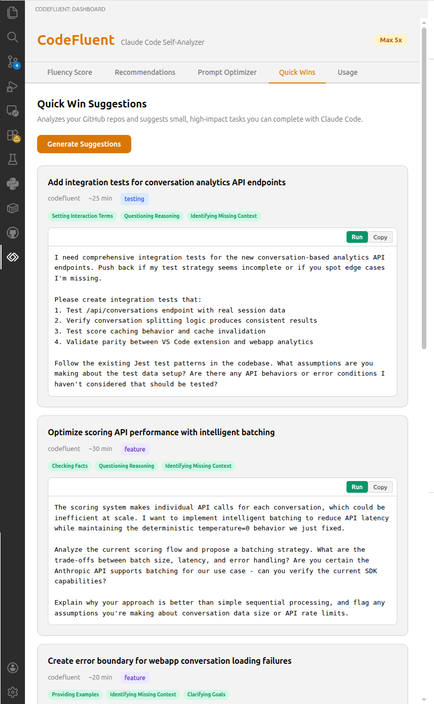
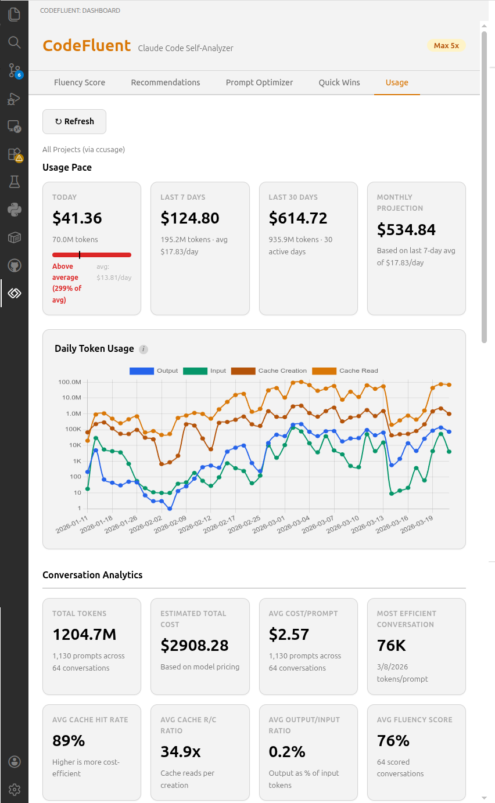
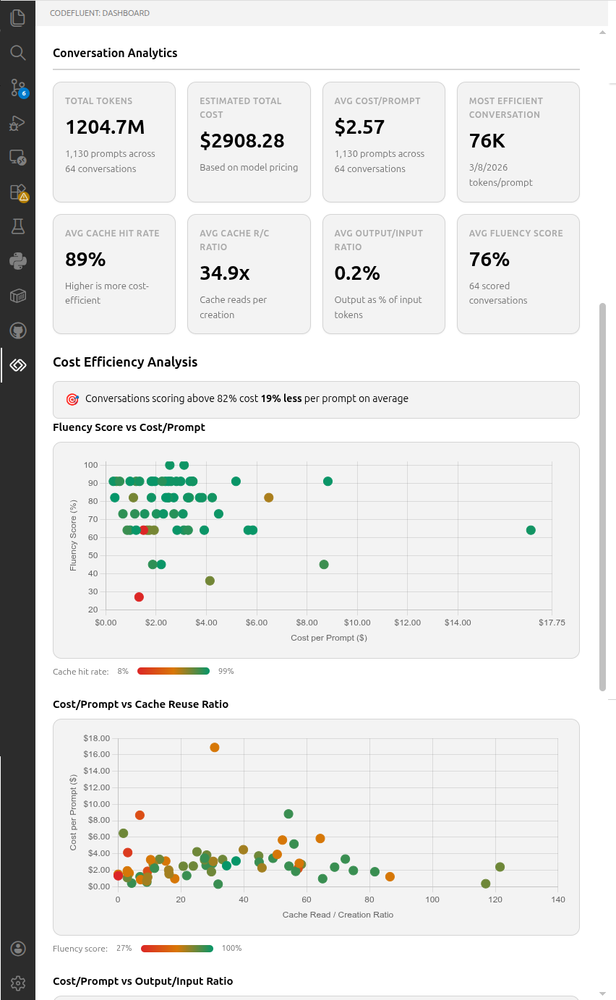
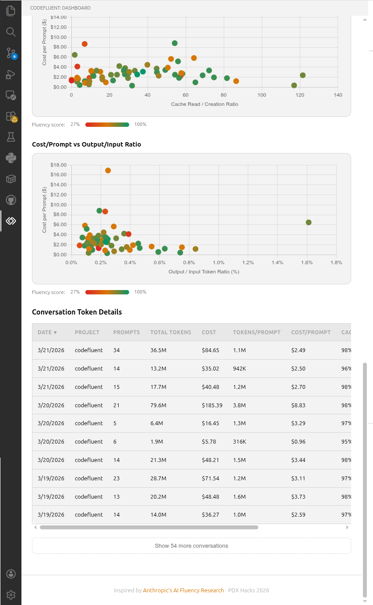

# CodeFluent

**Personal AI fluency analytics for Claude Code users.**

Millions of developers use AI coding assistants daily, but nobody knows if they're using them *well*. Anthropic's research shows most users exhibit only 3 of 11 key fluency behaviors, and that interaction patterns directly predict whether developers build skills or lose them.

CodeFluent reads your local Claude Code session data, scores your prompting behaviors against [Anthropic's AI Fluency Research](https://www.anthropic.com/research/AI-fluency-index), and gives you actionable recommendations to become a more effective AI collaborator. Available as a **VS Code extension** and a **standalone web app**.

Originally built at PDX Hacks 2026. Now publicly available and actively maintained.

### How It Compares

Several tools exist for monitoring Claude Code usage — but they all measure *what happened*, not *how well you collaborated*:

| Tool | What it measures | What's missing |
|------|-----------------|----------------|
| [ccusage](https://github.com/ryoppippi/ccusage) | Token counts, costs, model breakdown | No behavioral analysis |
| [Sniffly](https://github.com/chiphuyen/sniffly) (Chip Huyen) | Usage stats, error analysis, message history | Analyzes *Claude's* errors, not user behavior |
| [Claude-Code-Usage-Monitor](https://github.com/Maciek-roboblog/Claude-Code-Usage-Monitor) | Real-time token consumption, rate limit predictions | No quality scoring |
| [Anthropic Official Analytics](https://code.claude.com/docs/en/analytics) | PRs merged, lines committed, team adoption | Org-level metrics, no individual fluency |
| [DX Platform](https://getdx.com/) | Developer velocity, AI adoption rates | Enterprise focus, not behavioral |
| **CodeFluent** | **Fluency behaviors, interaction patterns, personalized coaching** | **The gap everyone else leaves open** |

Anthropic's own AI Fluency Index noted they "plan deeper study into Claude Code" but haven't shipped any behavioral scoring tool. CodeFluent fills that gap today.

### Why This Is Different

- **Research-grounded, not vibes.** Every score maps to Anthropic's AI Fluency Index (Feb 2026) and Coding Skills Formation study (Jan 2026). The benchmark bars are real population data.
- **First to score collaboration quality.** Existing tools count tokens or track errors. CodeFluent is the first to analyze *how* you interact with AI and whether your patterns build or erode skills.
- **AI evaluating AI collaboration.** Claude scores your prompts against the fluency framework, creating a feedback loop: the AI tells you how to work with it more effectively.
- **Not just scoring — active coaching.** The Prompt Optimizer and Quick Wins generate ready-to-use prompts that incorporate missing fluency behaviors and respect your project's CLAUDE.md config. They don't just tell you what to improve — they show you how.
- **Connects fluency to cost.** Conversation analytics links your fluency scores to token spending and cache efficiency, revealing which collaboration patterns are most cost-effective. No other tool examines these relationships.
- **Native VS Code integration.** Lives in your sidebar, respects your theme, launches Claude Code sessions directly from suggestions.
- **Completely local and private.** All session data stays on your machine. The only external calls are to the Anthropic API for scoring.
- **No server infrastructure.** No database, no auth, no backend to maintain. Install the `.vsix` and go.

### Conversations: The Right Unit of Analysis

Claude Code stores session data as JSONL files, but these files don't correspond to meaningful work units — a single file can span 8+ days of intermittent use, while a focused coding session might span multiple files. Scoring raw session files produces misleading results.

CodeFluent solves this with **conversations**: all messages from each of your project's session files are pooled, sorted by timestamp, and split into conversations whenever a gap between user prompts exceeds a configurable inactivity threshold (default: 60 minutes). Each conversation represents one focused interaction, the same unit of analysis used by Anthropic's AI Fluency Index (which scored 9,830 conversations).

This conversation assembly is CodeFluent's own contribution, designed to align with Anthropic's research and make our scores comparable to their benchmarks. The inactivity gap threshold is configurable via `conversation.inactivityGapMinutes` in VS Code settings or `webapp/config.json`. To understand your own timing patterns, run `webapp/analyze_gaps.py` to visualize inter-prompt gaps and decide if the default fits your workflow.

## Supported Platforms

| Platform | VS Code Extension | Web App | Shell used |
|----------|:-:|:-:|------------|
| Linux | Yes | Yes | `/bin/bash` |
| macOS | Yes | Yes | `/bin/bash` |
| Windows | Yes | Yes | `cmd.exe` |

Terminal launch, shell escaping, subprocess invocation, and session path resolution all adapt automatically to the host platform. No configuration required.

## Getting Started

### Prerequisites

- **All platforms:** Node.js 22+ (for `npx ccusage`), an [Anthropic API key](https://console.anthropic.com/settings/keys) (sign up at [console.anthropic.com](https://console.anthropic.com/) if you don't have one), [`gh` CLI](https://cli.github.com/) authenticated (`gh auth login` must be run before Quick Wins works), Git
- **VS Code extension:** VS Code 1.85+
- **Web app:** Python 3.12+ / `uv`
- **Windows:** No additional dependencies. The extension automatically uses `cmd.exe` and `npx.cmd` where needed.

### VS Code Extension

**Linux / macOS:**

```bash
git clone https://github.com/frederick-douglas-pearce/codefluent.git
cd codefluent/vscode-extension
npm install
npm run compile
npx @vscode/vsce package --allow-missing-repository
code --install-extension codefluent-*.vsix
```

**Windows (PowerShell):**

```powershell
git clone https://github.com/frederick-douglas-pearce/codefluent.git
cd codefluent\vscode-extension
npm install
npm run compile
npx @vscode/vsce package --allow-missing-repository
code --install-extension codefluent-*.vsix
```

Then reload VS Code. The CodeFluent icon appears in the activity bar.

### Web App

**Linux / macOS:**

```bash
git clone https://github.com/frederick-douglas-pearce/codefluent.git
cd codefluent/webapp
uv sync
uv run uvicorn main:app --reload --host 0.0.0.0 --port 8000
```

**Windows (PowerShell):**

```powershell
git clone https://github.com/frederick-douglas-pearce/codefluent.git
cd codefluent\webapp
uv sync
uv run uvicorn main:app --reload --host 0.0.0.0 --port 8000
```

Then open `http://localhost:8000` in your browser. Usage data is fetched on demand via the **Refresh** button in the Usage tab — no manual `ccusage` commands needed. See [`webapp/README.md`](webapp/README.md) for detailed setup instructions.

### Configure (API Key)

The extension looks for your API key in this order:

1. `ANTHROPIC_API_KEY` environment variable
2. `.env` file in the workspace root
3. VS Code secret storage (persisted after first prompt)
4. Interactive prompt (stored in VS Code secrets for next time)

The web app reads `ANTHROPIC_API_KEY` from the environment or a `.env` file in the `webapp/` directory.

**`.env` file format:**

```
ANTHROPIC_API_KEY=sk-ant-api03-...
```

### Session Data Location

Claude Code stores session files at `~/.claude/projects/` on all platforms:

| Platform | Path |
|----------|------|
| Linux | `~/.claude/projects/` |
| macOS | `~/.claude/projects/` |
| Windows | `C:\Users\<username>\.claude\projects\` |

CodeFluent resolves this automatically via the system home directory. If your session data is stored in a non-default location, you can override the path in VS Code settings (`codefluent.sessionDataPath`) or via the data path input in the webapp.

> **Note:** Session transcript files are only available from late January 2026 onward. Earlier Claude Code usage was not persisted as full transcripts. Subagent sessions (AI-spawned) are excluded from scoring. See [`docs/SESSION_DATA.md`](docs/SESSION_DATA.md) for details on data availability, storage format, and scoring scope.

## Screenshots

### Web App

<table>
<tr><th>Fluency Score</th><th>Conversations</th></tr>
<tr valign="top"><td></td><td></td></tr>
</table>

<table>
<tr><th>Configuration Maturity</th><th>Recommendations</th></tr>
<tr valign="top"><td></td><td></td></tr>
</table>

<table>
<tr><th>Prompt Optimizer</th><th>Quick Wins</th></tr>
<tr valign="top"><td></td><td></td></tr>
</table>

<table>
<tr><th>Usage</th><th>Conversation Analytics</th></tr>
<tr valign="top"><td></td><td></td></tr>
</table>

<table>
<tr><th>Cost Efficiency Charts</th></tr>
<tr><td></td></tr>
</table>

### VS Code Extension

<table>
<tr><th>Fluency Score</th><th>Conversations</th></tr>
<tr valign="top"><td></td><td></td></tr>
</table>

<table>
<tr><th>Configuration Maturity</th><th>Recommendations</th></tr>
<tr valign="top"><td></td><td></td></tr>
</table>

<table>
<tr><th>Prompt Optimizer</th><th>Quick Wins</th></tr>
<tr valign="top"><td></td><td></td></tr>
</table>

<table>
<tr><th>Usage</th><th>Conversation Analytics</th></tr>
<tr valign="top"><td></td><td></td></tr>
</table>

<table>
<tr><th>Cost Efficiency Charts</th></tr>
<tr><td></td></tr>
</table>

## Features

- **Fluency Score** — Scores your conversations against Anthropic's 11 fluency behaviors and 6 coding interaction patterns. Compares your results to published population benchmarks with color-coded bar charts.
- **Conversations** — Sortable table of all conversations with date, project, prompts, duration, tokens, cost, cache%, tools, and score columns. Expandable detail view shows metadata, tools used, custom commands/skills invoked, and full user prompts. Five interactive charts: conversations/week, length distribution, duration distribution, average prompts/week trend, and inter-prompt gap distribution with configurable threshold. Agent metrics cards with weekly sparklines show tool diversity, plan mode adoption, cache hit rate, and thinking utilization. Task type doughnut chart classifies conversations across 8 categories (feature, bug fix, refactor, debug, test, docs, chore, exploration).
- **Recommendations** — Personalized, research-backed coaching prioritized by impact, with copy-ready prompts and links to the underlying Anthropic research papers.
- **Configuration Maturity** — **The first tool to assess your Claude Code project configuration maturity — no known equivalent exists.** Scans your `.claude/` directory and scores your setup (0–100) across 8 weighted categories: CLAUDE.md placement and imports (20 pts), hooks with event types and file matchers (20 pts), rules with path scoping (15 pts), custom commands (10 pts), MCP servers (10 pts), skills with frontmatter (10 pts), permissions (5 pts), and enforcement coverage (10 pts). A tier badge (Beginner / Intermediate / Advanced / Expert) summarizes your maturity level. Enforcement gap detection identifies rules in your CLAUDE.md that lack programmatic enforcement via hooks and assigns severity levels. The Configuration Advisor generates ready-to-use hook configurations from enforcement gaps using Claude, with one-click copy to clipboard. Covers the same configuration competencies tested in the [Claude Certified Architect (CCA)](https://www.anthropic.com/news/claude-certified-architect) exam — use it to validate and improve your project configuration skills. This is the foundation for the CCA readiness radar, interaction quality metrics, and outcome analysis planned for future releases.
- **Prompt Optimizer** — Paste any prompt and get an optimized version that naturally incorporates missing fluency behaviors. Considers your CLAUDE.md config so it won't add behaviors already covered by project conventions. Shows before/after effective scores, highlights added behaviors, and lets you copy or run the improved prompt directly.
- **Quick Wins** — Scans your GitHub repos (commits, issues, README status) and generates copy-paste-ready Claude Code prompts for high-value tasks. In the VS Code extension, a "Run" button launches Claude Code in an integrated terminal with the suggested prompt. In the web app, prompts are copied to clipboard for pasting into your terminal — giving you more control and safer cross-platform behavior.
- **Usage Dashboard** — Two complementary views of your Claude Code usage. **All-projects analytics** (via [ccusage](https://github.com/ryoppippi/ccusage)) shows daily usage pace cards, cost projections, and a stacked token breakdown chart across all projects. **Conversation analytics** (from parsed JSONL history) shows per-conversation efficiency metrics — cost/prompt, cache hit rates, output/input ratios — with summary cards, three cost-efficiency scatter charts colored by fluency score, and a sortable details table. A **Refresh** button fetches the latest data on demand.
- **CLAUDE.md Config Scoring** — Scores your project's CLAUDE.md file against 3 meta-interaction behaviors that can genuinely be established as project conventions: *setting interaction terms*, *identifying missing context*, and *questioning reasoning*. Behaviors defined in your CLAUDE.md (e.g., "push back if wrong") boost your effective score via `conversation OR config` logic, with a "CLAUDE.md" attribution tag in the UI. The remaining 8 behaviors are task-specific and can only be demonstrated through actual prompts.
- **Status Bar** — Shows your aggregate fluency score at a glance in the VS Code status bar.
- **VS Code Theming** — Automatically respects your light/dark theme.
- **Project Scoping (Web App)** — A project dropdown filters fluency scoring, prompt optimization, quick wins, conversations, and conversation analytics to a specific project, so you can analyze each codebase independently.

## How It Works

1. **Parse** — JSONL session files from the session data path (`~/.claude/projects/` by default) are parsed to extract user prompts, assistant responses, and token usage metadata. System commands (`/clear`, `/compact`, etc.) are filtered out; custom commands and skills are tracked separately.
2. **Assemble conversations** — All messages per project are pooled, sorted by timestamp, and split into conversations at inactivity gaps between user prompts (configurable via `conversation.inactivityGapMinutes`, default: 60 minutes). `/clear` commands force a conversation boundary. Each conversation is classified by task type (feature, bug fix, refactor, etc.) via heuristic analysis of branch names and prompt keywords.
3. **Score** — User prompts (up to 20 per conversation, max 2000 chars each) are sent to the scoring model (`scoring.model`, default: `claude-sonnet-4-20250514`) with `temperature: 0` for deterministic fluency scoring against Anthropic's 11 behaviors and 6 coding interaction patterns
4. **Config scoring** — If a `CLAUDE.md` exists, it's scored against 3 config-eligible meta-interaction behaviors. Results are merged via `effective = conversation OR config`
5. **Config maturity** — The `.claude/` directory is scanned for hooks, rules, commands, skills, MCP servers, CLAUDE.md, and permissions. Enforcement gaps are detected by cross-referencing CLAUDE.md enforcement language against hook configuration.
6. **Agent metrics** — Tool diversity, plan mode adoption, cache hit rate, and thinking utilization are computed from parsed session metadata and aggregated weekly for trend analysis.
7. **Cache** — Scores are cached locally (by conversation ID, content hash, and prompt version) in both the VS Code extension and webapp to avoid re-scoring unchanged conversations
8. **Usage analytics** — `ccusage` provides all-projects token/cost data; per-conversation efficiency metrics (cost/prompt, cache hit rates, output/input ratios) are computed from parsed JSONL token data

Everything runs locally. No data leaves your machine except the API calls to Anthropic for scoring.

## Eval Framework

CodeFluent uses an LLM-as-judge architecture — an LLM scores user prompts against 11 fluency behaviors. This creates a challenge: how do you ensure scoring quality doesn't degrade when you update prompt templates, switch models, or add new LLM providers?

The eval framework (`shared/eval/`) solves this with a golden set of 50 human-labeled entries and an automated regression runner that validates scoring outputs before changes ship. As CodeFluent expands beyond Claude to support additional LLM providers, the eval framework provides the ground truth needed to validate that scoring remains accurate and consistent across models.

### Golden Set

50 curated entries across 4 scoring sections, each with human-verified expected behaviors and rationale:

| Section | Entries | What it validates |
|---------|---------|-------------------|
| Single-prompt scoring | 25 | Behavior classification across the full score range (0–100) |
| Session scoring | 12 | Multi-prompt sessions with metadata signals (plan mode, tools, thinking) |
| Config scoring | 8 | CLAUDE.md files testing behavior credit boundaries |
| Optimizer | 5 | Input scoring accuracy and config-aware skip logic |

Entries span web dev, data science, systems programming, mobile, infrastructure, and edge cases (injection attempts, code-only prompts, ambiguous requests).

### Automated Checks

The eval runner (`run_eval.py`) implements 5 checks:

| Check | What it measures | When to use |
|-------|-----------------|-------------|
| **Schema** | Response structure validity (keys, types, value ranges) | Every run |
| **Agreement** | Behavior-level match rate vs. human labels (target: 85%+) | Every run |
| **Consistency** | Self-agreement across repeated runs (measures model determinism) | Before model changes |
| **Drift** | Activation rate shifts >15pp against a baseline | After model updates |
| **Regression** | Side-by-side diff between two prompt versions | Before prompt bumps, cross-model validation |

### CI Integration

A dedicated GitHub Actions workflow (`eval.yml`) automatically runs schema + agreement checks on any PR that modifies prompt templates (`shared/prompts/**`). This catches scoring regressions before they reach production — no manual testing required.

```bash
# Run locally before a prompt change
cd webapp
uv run python ../shared/eval/run_eval.py --dry-run           # Preview what will run
uv run python ../shared/eval/run_eval.py                      # Full schema + agreement check
uv run python ../shared/eval/run_eval.py --check consistency  # Self-consistency analysis
```

Cost: ~$0.25 for a full 50-entry run, ~$0.15 for CI (33-entry subset). See [`shared/eval/README.md`](shared/eval/README.md) for full documentation.

## Security

| Layer | Mechanism | Protects Against |
|-------|-----------|------------------|
| XSS | `escapeHtml()` on all user-controlled output | Script injection |
| CSP | Nonce-based `script-src` in webview | Inline script execution |
| Shell injection | `execFileSync` with arg arrays + GitHub name validation | Command injection |
| API key secrets | VS Code SecretStorage / env var / `.env` | Credential leakage |
| Input validation | Pydantic constraints, length limits, path checks | Oversized payloads, path traversal |
| Rate limiting | 10 req/min sliding window (webapp) | API abuse |
| CORS | Localhost-only default (webapp) | Unauthorized cross-origin access |
| Automated testing | 1653 tests including security-focused suites | Regressions |
| CI security review | Claude security review on PRs | New vulnerabilities |

All user-controlled strings are escaped before rendering in HTML. Shell commands use argument arrays (`execFileSync`) instead of string interpolation. The webapp validates all inputs with Pydantic models and enforces rate limits. Security-focused test suites verify XSS and injection protections.

## Troubleshooting

| Problem | Solution |
|---------|----------|
| **No sessions found** | Check that `~/.claude/projects/` contains `.jsonl` session files. Claude Code creates these automatically during use. |
| **API key not found** | The extension checks: env var → workspace `.env` → VS Code secrets → interactive prompt. Make sure `ANTHROPIC_API_KEY` is set in at least one location. |
| **Quick Wins shows no results** | Run `gh auth login` to authenticate the GitHub CLI. Quick Wins requires `gh` to fetch repo context and issues. |
| **ccusage returns no data** | Click the Refresh button in the Usage tab, or run `npx ccusage@latest daily --json` manually to verify output. Ensure you've used Claude Code at least once so session data exists. |
| **Extension doesn't activate** | Look for the CodeFluent icon in the VS Code activity bar (left sidebar). If missing, try reloading the window (`Ctrl+Shift+P` → "Reload Window"). |
| **VSIX is too small (~100KB)** | The `.vscodeignore` file must not exclude `node_modules/`. The Anthropic SDK is a runtime dependency and must be bundled. Expected VSIX size is ~1.2MB. |

## Tech Stack

- **VS Code extension:** TypeScript / VS Code WebviewViewProvider
- **Web app:** Python / FastAPI / `uv`
- **Frontend (both):** Vanilla HTML/CSS/JS + Chart.js (bundled locally)
- **Scoring:** Anthropic API (`claude-sonnet-4-20250514`)
- **Usage data:** [ccusage](https://github.com/ryoppippi/ccusage) (reads Claude Code sessions)
- **GitHub integration:** `gh` CLI
- **Testing:** Jest + ts-jest (extension)

## Project Structure

```
codefluent/
├── vscode-extension/          # VS Code extension (primary)
│   ├── src/
│   │   ├── extension.ts       # Activation, status bar, command registration
│   │   ├── webviewProvider.ts # WebviewViewProvider, IPC, terminal launch
│   │   ├── parser.ts          # JSONL session file parsing
│   │   ├── scoring.ts         # Fluency scoring via Anthropic API
│   │   ├── conversation.ts    # Conversation assembly (gap-based splitting)
│   │   ├── usage.ts           # ccusage CLI bridge
│   │   ├── quickwins.ts       # GitHub integration + task suggestions
│   │   ├── prompts.ts         # Prompt loader + template filler
│   │   ├── analytics.ts       # Conversation token analytics (efficiency, cost)
│   │   ├── pricing.ts         # Token pricing lookup
│   │   ├── agentMetrics.ts     # Agent behavior metrics computation
│   │   ├── taskClassification.ts  # Heuristic task type classifier
│   │   ├── antiPatterns.ts    # Structured output anti-pattern detection
│   │   ├── configScanner.ts   # .claude/ directory maturity scanner
│   │   ├── enforcementGaps.ts # Advisory-vs-programmatic gap detection
│   │   ├── cache.ts           # Persistent score caching
│   │   ├── dataCache.ts       # Conversation/usage data caching
│   │   └── platform.ts        # Cross-platform shell, terminal, subprocess helpers
│   ├── media/
│   │   ├── index.html         # Webview UI
│   │   ├── app.js             # Frontend logic + Chart.js rendering
│   │   ├── style.css          # VS Code theme-aware design system
│   │   ├── icon.svg           # Activity bar icon
│   │   └── libs/chart.min.js  # Chart.js (bundled, no CDN)
│   ├── test/
│   │   ├── unit/              # Unit tests (scoring, parsing, caching, XSS, platform)
│   │   └── integration/       # Integration tests (extension, webview)
│   ├── package.json
│   └── tsconfig.json
├── webapp/                    # FastAPI web app (standalone alternative)
│   ├── main.py                # FastAPI backend
│   ├── conversations.py       # Python conversation assembly equivalent
│   ├── extract_prompts.py     # Python JSONL prompt extractor
│   ├── agent_metrics.py       # Agent behavior metrics computation
│   ├── task_classification.py # Heuristic task type classifier
│   ├── anti_patterns.py       # Structured output anti-pattern detection
│   ├── config_scanner.py      # .claude/ directory maturity scanner
│   ├── enforcement_gaps.py    # Advisory-vs-programmatic gap detection
│   ├── config.py              # Centralized config (shared/defaults.json + env vars)
│   ├── static/                # Web frontend (HTML/CSS/JS)
│   ├── tests/                 # Pytest suite (API, security, helpers, prompts, config)
│   └── pyproject.toml         # Python dependencies
├── shared/                    # Shared resources (both interfaces)
│   ├── benchmarks.json        # Population benchmark data
│   ├── pricing.json           # Token pricing by model
│   ├── prompts/               # Versioned prompt templates
│   │   ├── registry.json      # Active version pointers
│   │   ├── scoring/v1.0.md        # Session scoring prompt
│   │   ├── config/v1.0.md         # CLAUDE.md scoring prompt
│   │   ├── optimizer/v1.1.md      # Prompt optimizer prompt (config-aware)
│   │   ├── single_scoring/v1.0.md # Single-prompt verification scorer
│   │   └── config_advisor/v1.0.md # Hook config generation prompt
│   └── eval/                  # Scoring regression testing
│       ├── golden_set.json    # 50 curated test cases
│       ├── run_eval.py        # CLI runner (schema, agreement, drift, regression checks)
│       └── README.md          # Eval framework docs
├── docs/                      # Design docs and specs
│   ├── PROJECT_PLAN.md
│   ├── TECHNICAL_SPEC.md
│   ├── UI_SPEC.md
│   ├── SESSION_DATA.md
│   ├── RELEASE_ROADMAP.md
│   ├── REFERENCES.md
│   └── DEMO_SCRIPT.md
├── images/                    # Demo screenshots
└── CLAUDE.md                  # AI coding instructions
```

## Development

### VS Code Extension

```bash
cd vscode-extension
npm install
npm run watch          # Continuous TypeScript compilation
# Press F5 in VS Code to launch Extension Development Host
```

See [`vscode-extension/README.md`](vscode-extension/README.md) for full setup, packaging, and installation details.

### Web App

```bash
cd webapp
uv sync
uv run uvicorn main:app --reload --host 0.0.0.0 --port 8000
```

See [`webapp/README.md`](webapp/README.md) for configuration, CORS, and Windows notes.

### Testing

The project has **1653 automated tests** across both interfaces:

```bash
cd vscode-extension
npm test                   # 907 tests across 22 suites (Jest)

cd webapp
uv run pytest tests/ -v    # 746 tests across 12 suites (pytest)
```

Test suites cover scoring, parsing, caching, analytics, pricing, agent metrics, task classification, anti-pattern detection, configuration scanning, enforcement gaps, XSS prevention, shell injection, path traversal, rate limiting, CORS, API surface, and scoring prompt regression testing. The eval framework (`shared/eval/`) validates scoring outputs against a [golden set of 50 curated entries](shared/eval/README.md). All tests must pass before merging to main.

### CI/CD

Five GitHub Actions workflows run automatically:

- **CI** (`ci.yml`) — Runs on every PR: compiles TypeScript, runs all 1653 tests, plus `npm audit` and `pip-audit` for dependency vulnerabilities. Must pass to merge.
- **Eval** (`eval.yml`) — Runs on PRs that modify `shared/prompts/**`: scores the golden set via the Anthropic API, validates schema + agreement against human-labeled ground truth. See [Eval Framework](#eval-framework) below.
- **Claude Code Review** (`claude-review.yml`) — AI-powered PR review, responds to `@claude` mentions.
- **Security Review** (`security-review.yml`) — Grep-based checks for security anti-patterns (inline onclick, string interpolation in shell commands, missing escapeHtml).
- **Release** (`release.yml`) — Triggered by version tags (`v*`). Builds VSIX, publishes to VS Code Marketplace, uploads to GitHub Release.
- **Release Please** (`release-please.yml`) — Auto-generates release PRs with changelog updates and version bumps from [Conventional Commits](https://www.conventionalcommits.org/).

### Branching Strategy

- **`main`** — Always releasable. Protected by CI, requires a PR to merge.
- **`feature/<issue>-desc`** — New features (e.g., `feature/44-remaining-recommendations`)
- **`fix/<issue>-desc`** — Bug fixes (e.g., `fix/46-cache-unbounded`)

Commit messages use [Conventional Commits](https://www.conventionalcommits.org/) (`feat:`, `fix:`, `docs:`, etc.) for automated changelog generation. See [`CONTRIBUTING.md`](CONTRIBUTING.md) for details.

## Contributing

Contributions are welcome! See [`CONTRIBUTING.md`](CONTRIBUTING.md) for dev setup, code conventions, security rules, and the PR checklist.

## Roadmap

**Coming in v1.2:**
- **LLM-powered task classification** — upgrade heuristic classification with few-shot LLM classification and golden set validation
- **Interaction quality metrics** — error recovery patterns, verification behavior, learning trajectory
- **Task-type normalization** — per-task-type expected ranges for agent metrics

**Planned (v1.3+):**
- **CCA readiness radar** — 5-axis radar chart mapping your usage to Claude Certified Architect competency domains
- **Scoring quality infrastructure** — confidence calibration, user feedback signals, cross-model agreement testing
- **Outcome metrics** — commit quality analysis, MCP integration assessment, CI/CD scoring

See the [Release Roadmap](docs/RELEASE_ROADMAP.md) for details, or browse [open milestones](https://github.com/frederick-douglas-pearce/codefluent/milestones) on GitHub.

## Research Foundations

- [Anthropic AI Fluency Index](https://www.anthropic.com/research/AI-fluency-index) (Feb 2026) — 11 behavioral indicators and population benchmarks
- [Coding Skills Formation with AI](https://www.anthropic.com/research/coding-skill-formation) (Jan 2026) — 6 coding interaction patterns and quality analysis
- [Claude Code Best Practices](https://www.anthropic.com/research/claude-code-best-practices) — Practical guidelines for effective AI collaboration

## License

[MIT](LICENSE)
