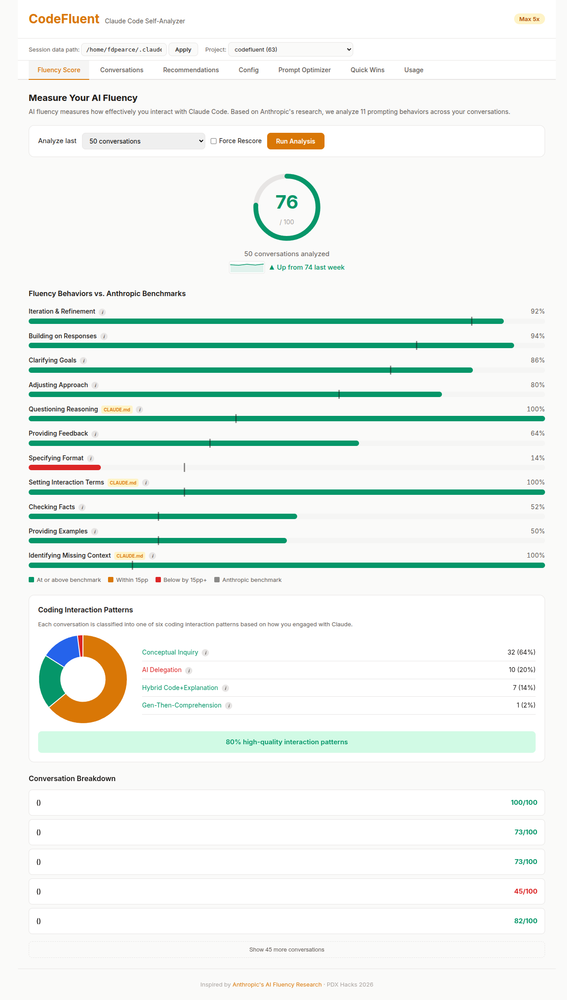
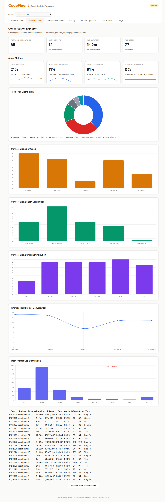
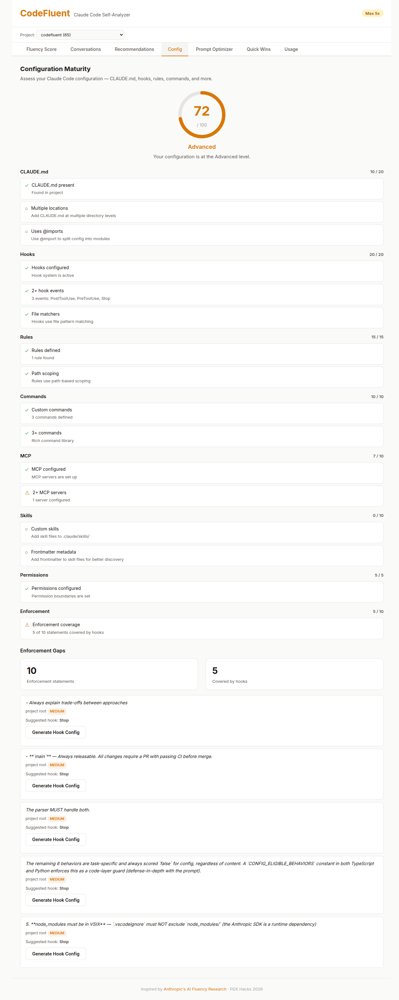
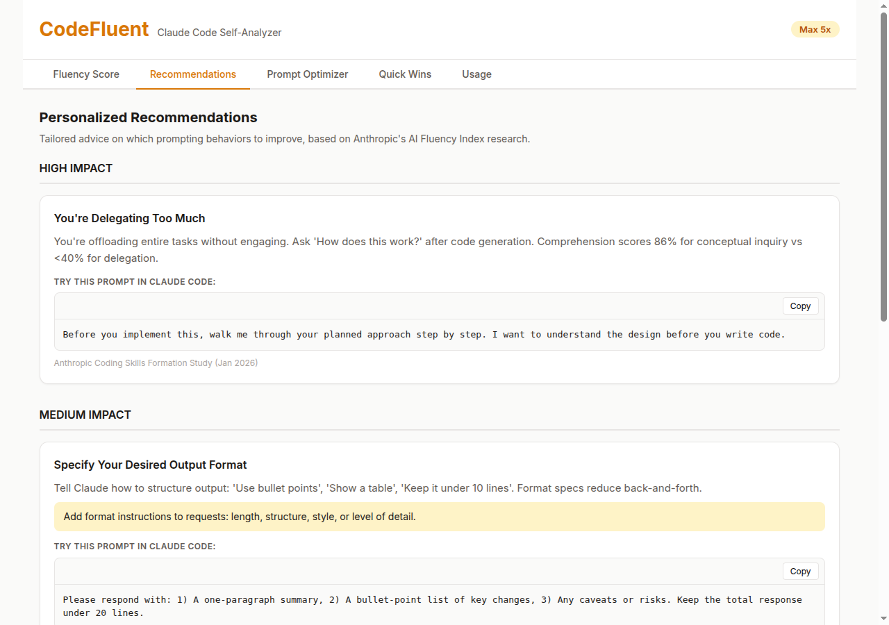
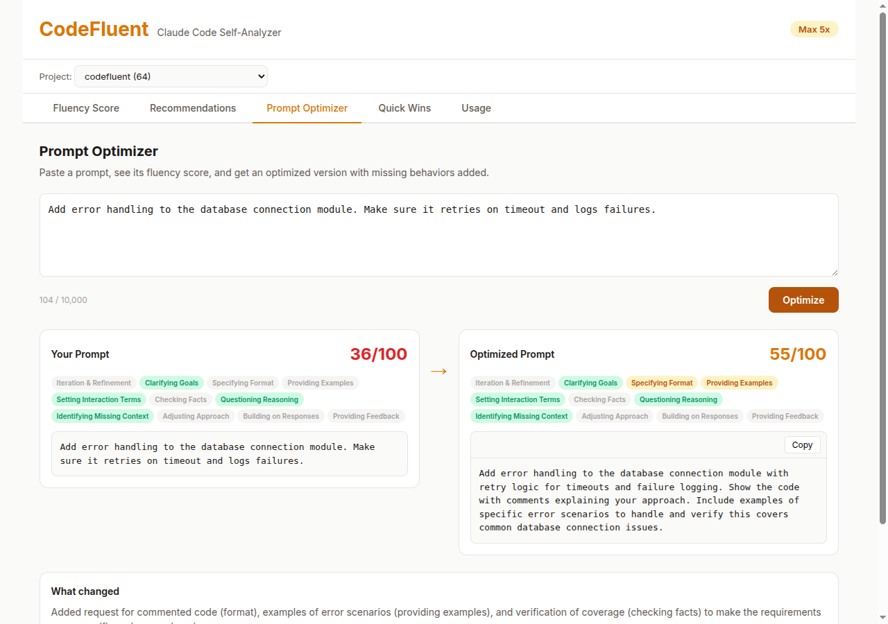
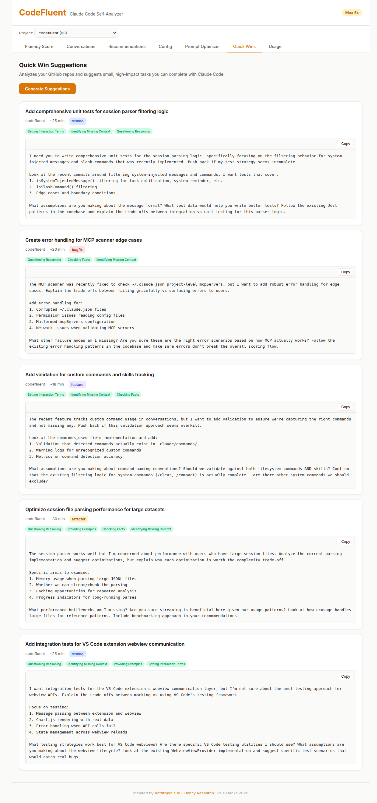
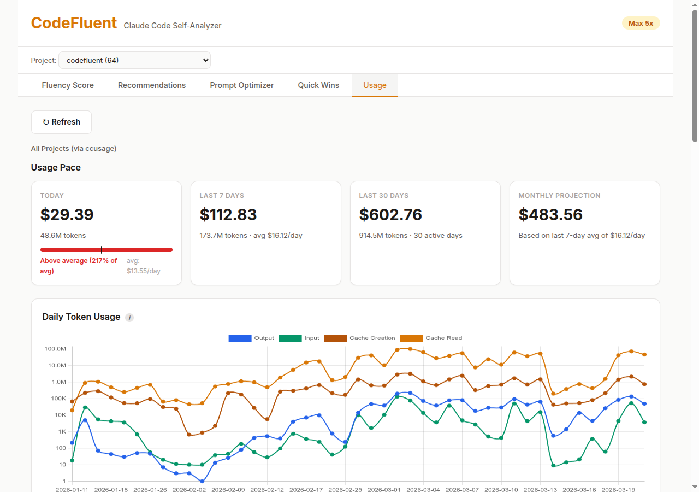
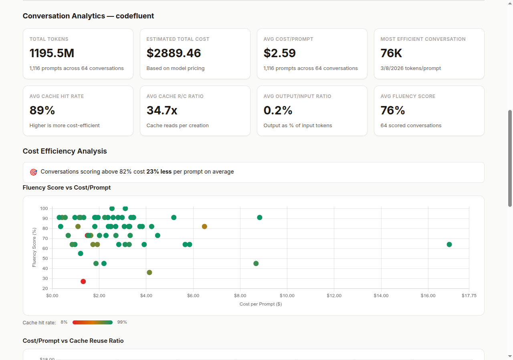
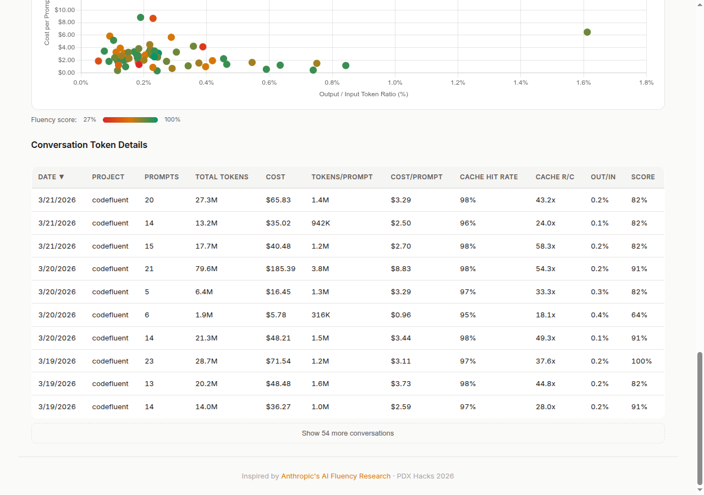

# CodeFluent Web App

**AI fluency analytics for Claude Code users** — standalone web interface as an alternative to the VS Code extension.

CodeFluent parses your local Claude Code session files, scores your prompts against 11 research-backed fluency behaviors, and shows you exactly how to improve. Built with FastAPI (Python) and vanilla HTML/CSS/JS.

See the [main README](../README.md) for the full project overview. This document covers webapp-specific details — setup, design choices, testing, and security — that differ from the VS Code extension.

## Getting Started

### Prerequisites

- **Python 3.12+** with **[uv](https://docs.astral.sh/uv/)** (Python package manager)
- **Node.js 22+** (for `npx ccusage`)
- **[Anthropic API key](https://console.anthropic.com/settings/keys)** — required for fluency scoring
- **[`gh` CLI](https://cli.github.com/)** authenticated (`gh auth login`) — required for Quick Wins
- **Git** — version control

### Setup

1. **Install dependencies and start the server:**

   **Linux / macOS:**

   ```bash
   cd codefluent/webapp
   uv sync
   uv run uvicorn main:app --reload --host 0.0.0.0 --port 8000
   ```

   **Windows (PowerShell):**

   ```powershell
   cd codefluent\webapp
   uv sync
   uv run uvicorn main:app --reload --host 0.0.0.0 --port 8000
   ```

2. **Open [http://localhost:8000](http://localhost:8000)** in your browser.

3. **Set your API key** — either via environment variable or a `.env` file in `webapp/`:

   ```
   ANTHROPIC_API_KEY=sk-ant-api03-...
   ```

Usage data and session prompts are fetched on demand — no manual export steps needed. Click the **Refresh** button in the Usage tab to pull the latest data.

## Features

See the [main README](../README.md#features) for feature descriptions. Screenshots below show the webapp interface:

<table>
<tr><th>Fluency Score</th><th>Conversations</th></tr>
<tr valign="top"><td></td><td></td></tr>
</table>

<table>
<tr><th>Configuration Maturity</th><th>Recommendations</th></tr>
<tr valign="top"><td></td><td></td></tr>
</table>

<table>
<tr><th>Prompt Optimizer</th><th>Quick Wins</th></tr>
<tr valign="top"><td></td><td></td></tr>
</table>

<table>
<tr><th>Usage Dashboard</th><th>Conversation Analytics</th><th>Charts & Details</th></tr>
<tr valign="top"><td></td><td></td><td></td></tr>
</table>

## Webapp-Specific Design Choices

The webapp provides the same core functionality as the VS Code extension but adapts the UX for a browser context. Key differences:

### Project Scoping via Dropdown

The VS Code extension automatically detects the current workspace's GitHub repo via `git remote get-url origin`. The webapp has no workspace context, so it provides a **project dropdown** that lets users select which project to analyze.

- The dropdown populates from session data, showing each project's name and conversation count
- Selection is persisted in `localStorage` across page reloads
- The frontend resolves the short project name (e.g., "codefluent") to the encoded path (e.g., `-home-user-codefluent`) before sending API requests
- Project scoping applies to: Fluency Score, Prompt Optimizer, Quick Wins, and Conversation Analytics (Usage tab)

### Settings Bar Visibility

The settings bar adapts per tab to show only relevant controls:

| Tab | Data Path | Project Dropdown |
|-----|-----------|-----------------|
| Fluency Score | Shown | Shown |
| Conversations | Hidden | Shown |
| Recommendations | Hidden | Hidden |
| Config | Hidden | Shown |
| Prompt Optimizer | Hidden | Shown |
| Quick Wins | Hidden | Shown |
| Usage | Hidden | Shown |

### Copy-to-Clipboard (No Terminal Integration)

The VS Code extension can launch prompts directly in an integrated terminal. The webapp instead provides **copy-to-clipboard** buttons (using `navigator.clipboard`), allowing users to paste prompts into their own terminal. This applies to Quick Wins tasks, optimizer output, and recommendation examples.

### On-Demand Data Refresh

Usage data is fetched via `ccusage` CLI on the server. The webapp runs three `ccusage` commands in parallel (`daily`, `monthly`, `session`) when the user clicks **Refresh**, storing results in `data/ccusage/`. The extension calls `ccusage` through IPC on each request.

### Health Endpoint

The webapp exposes `GET /health` returning server status, version, and dependency checks (API key configured, data directory accessible). This has no equivalent in the extension, which runs inside VS Code and is always accessible.

## How It Works

1. **Parse** — JSONL session files from `~/.claude/projects/` are parsed to extract user prompts, assistant responses, and token usage metadata. System commands (`/clear`, `/compact`, etc.) are filtered out; custom commands and skills are tracked separately.
2. **Assemble conversations** — All messages per project are pooled, sorted by timestamp, and split into conversations at inactivity gaps between user prompts (configurable via `conversation.inactivityGapMinutes`, default: 60 minutes). `/clear` commands force a conversation boundary. Each conversation is classified by task type (feature, bug fix, refactor, etc.) via heuristic analysis of branch names and prompt keywords.
3. **Score** — User prompts (up to 20 per conversation, max 2000 chars each) are sent to the scoring model (`scoring.model`, default: `claude-sonnet-4-20250514`) with `temperature: 0` for deterministic fluency scoring against Anthropic's 11 behaviors and 6 coding interaction patterns
4. **Config scoring** — If a `CLAUDE.md` exists, it's scored against 3 config-eligible meta-interaction behaviors. Results are merged via `effective = conversation OR config`
5. **Config maturity** — The `.claude/` directory is scanned for hooks, rules, commands, skills, MCP servers, CLAUDE.md, and permissions. Enforcement gaps are detected by cross-referencing CLAUDE.md enforcement language against hook configuration.
6. **Agent metrics** — Tool diversity, plan mode adoption, cache hit rate, and thinking utilization are computed from parsed session metadata and aggregated weekly for trend analysis.
7. **Cache** — Scores are cached locally (by conversation ID, content hash, and prompt version) to avoid re-scoring unchanged conversations
8. **Usage analytics** — `ccusage` provides all-projects token/cost data; per-conversation efficiency metrics (cost/prompt, cache hit rates, output/input ratios) are computed from parsed JSONL token data

Everything runs locally. No data leaves your machine except the API calls to Anthropic for scoring.

## Configuration

### Port

The server runs on port 8000 by default. Change it with the `PORT` environment variable:

```bash
PORT=3000 uv run uvicorn main:app --reload --host 0.0.0.0 --port 3000
```

### API Key

Set `ANTHROPIC_API_KEY` via environment variable or a `.env` file in the `webapp/` directory. Unlike the extension, the webapp does not support interactive prompting for the key — it must be configured before starting the server.

### CORS

CORS is restricted to localhost origins by default. The allowed origin is determined by the `PORT` environment variable (`http://localhost:{PORT}`). Override with `CORS_ORIGINS` for custom origins (comma-separated).

## Testing

The webapp has **746 tests** across 12 suites. Run with:

```bash
cd webapp
uv run pytest tests/ -v         # Run all tests
uv run pytest tests/test_api.py  # Run a specific suite
uv run pytest tests/test_eval.py -m live  # Run live API eval tests (~$0.02)
```

| Suite | Tests | What it covers |
|-------|-------|----------------|
| `test_api.py` | 65 | Health endpoint, conversations, scores, scoring, optimizer, quickwins, usage, conversation analytics, config maturity |
| `test_helpers.py` | 75 | Path decoding, repo detection, validators, `compute_aggregate`, cost estimation, error classification |
| `test_security.py` | 38 | Rate limiting, CORS, error leakage, path traversal, security headers, XSS source-level verification |
| `test_extract_prompts.py` | 74 | JSONL parsing, content extraction, session filtering, command extraction, metadata |
| `test_conversations.py` | 63 | Conversation assembly, gap-based splitting, boundary detection, commands_used aggregation |
| `test_config.py` | 11 | Centralized config module (defaults, env vars, config.json overrides) |
| `test_analyze_gaps.py` | 47 | Inter-prompt gap analysis, histogram generation |
| `test_prompts.py` | 17 | Prompt loading, template filling, registry consistency |
| `test_eval.py` | 79 | Eval framework: scorer, checks, report, CLI args, golden set integration (+ 3 live API tests) |
| `test_task_classification.py` | 30 | Branch prefix mapping, keyword regex, classification priority |
| `test_anti_patterns.py` | 37 | Structured output anti-pattern detection, false positive avoidance |
| `test_config_scanner.py` | 54 | .claude/ directory scanning, frontmatter parsing, MCP detection, endpoint tests |

Live API tests (`@pytest.mark.live`) are excluded by default and require `ANTHROPIC_API_KEY`. Run with `-m live` to include them.

See [CONTRIBUTING.md](../CONTRIBUTING.md) for the full PR checklist and test requirements.

## Security

The webapp has security concerns that don't apply to the VS Code extension (which runs in a sandboxed webview). These are tested in `test_security.py`.

### Rate Limiting

Scoring and optimizer endpoints are rate-limited to **10 requests per minute** (in-memory sliding window). Returns HTTP 429 when exceeded. This prevents accidental API cost spikes from rapid repeated requests.

### CORS

Only `localhost` origins are allowed by default, preventing cross-origin requests from external hosts. Configurable via the `CORS_ORIGINS` environment variable.

### Path Traversal Protection

The `_decode_project_path()` function validates all decoded paths using `Path.resolve()` and `Path.is_relative_to(home)` to ensure requests cannot access files outside the user's home directory. This blocks attacks like `../../etc/passwd` encoded as project paths.

### Security Headers

All responses include:
- `X-Content-Type-Options: nosniff`
- `X-Frame-Options: DENY`
- `X-XSS-Protection: 1; mode=block`
- `Referrer-Policy: strict-origin-when-cross-origin`

### Error Sanitization

All error messages pass through `_sanitize_error()` to strip `sk-ant-*` API key tokens before returning to the client. This prevents accidental key leakage in error responses.

### XSS Prevention

User-controlled strings rendered in HTML use `escapeHtml()` in the frontend. The `test_security.py` suite includes source-level verification that no unescaped user input is rendered in HTML contexts.

## Session Data

Claude Code stores session transcripts as JSONL files at `~/.claude/projects/` by default. If your session data is in a non-default location, enter the path in the data path input on the Fluency Score tab. **Session transcripts are only available from late January 2026 onward** — earlier Claude Code usage was not persisted as full transcripts. Subagent sessions are excluded from scoring because they contain AI-generated prompts, not human input.

CodeFluent assembles these raw session files into conversations (gap-based splitting at configurable inactivity thresholds) before scoring. See the [main README](../README.md#conversations-the-right-unit-of-analysis) for details.

| Platform | Path |
|----------|------|
| Linux | `~/.claude/projects/` |
| macOS | `~/.claude/projects/` |
| Windows | `C:\Users\<username>\.claude\projects\` |

See [`docs/SESSION_DATA.md`](../docs/SESSION_DATA.md) for details on data availability, storage format, and scoring scope.

## Troubleshooting

| Problem | Solution |
|---------|----------|
| **No sessions found** | Check that `~/.claude/projects/` contains `.jsonl` session files. Claude Code creates these automatically during use. |
| **API key not found** | Set `ANTHROPIC_API_KEY` via environment variable or `.env` file in `webapp/` |
| **ccusage returns no data** | Click the Refresh button in the Usage tab, or run `npx ccusage@latest daily --json` manually to verify output. Ensure you've used Claude Code at least once. |
| **Quick Wins shows no results** | Run `gh auth login` to authenticate the GitHub CLI |
| **Health endpoint shows degraded** | Check that `ANTHROPIC_API_KEY` is set and the `data/` directory is writable |

## Development

```bash
uv run uvicorn main:app --reload --host 0.0.0.0 --port 8000
```

The `--reload` flag enables auto-reload on file changes. Edit files in `static/` for the frontend or `main.py` for the backend.

See [CONTRIBUTING.md](../CONTRIBUTING.md) for code conventions, branching strategy, and the full PR checklist.

## Windows Notes

- Use `\` instead of `/` in paths (e.g., `..\data\ccusage\daily.json`)
- Use `$env:ANTHROPIC_API_KEY = "sk-ant-api03-..."` to set environment variables in PowerShell
- Session files are at `C:\Users\<username>\.claude\projects\`

## License

[MIT](../LICENSE)
